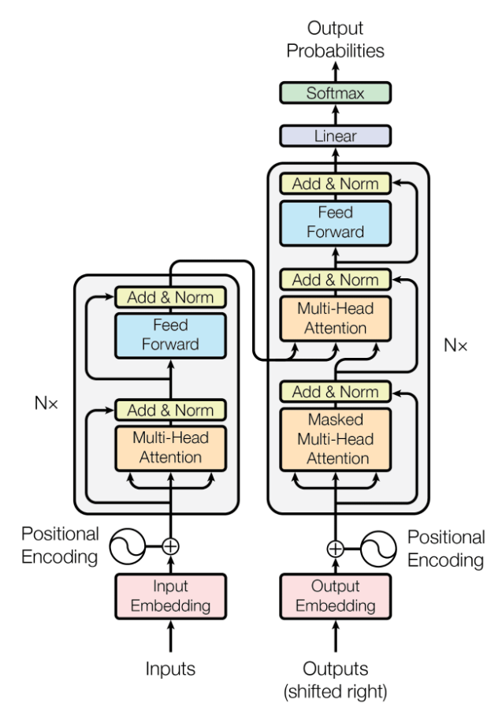
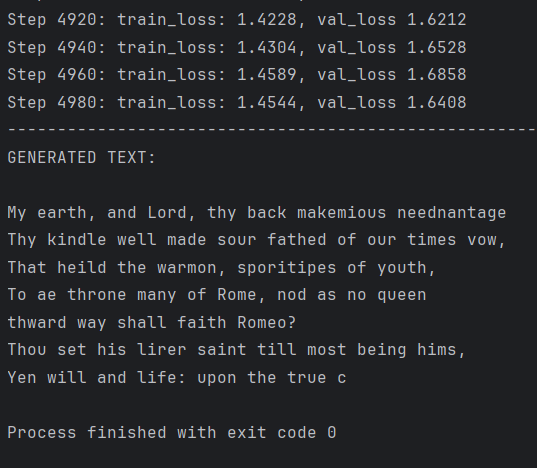

# CharGPT

This repository contains code to build a Generative Pretrained Transformer (GPT) model from scratch, inspired by Andrej Karpathy's video tutorial on transformers and GPT architectures. Following concepts from the foundational paper ["Attention is All You Need"](https://arxiv.org/abs/1706.03762) and OpenAI's GPT-2/GPT-3, this project explores language modeling and the inner workings of transformers, with each component implemented from the ground up.




## Project Overview

In this project, I develop a baseline GPT model using PyTorch, following Andrej Karpathy's tutorial structure. The project includes:
- **Data preprocessing** and **tokenization**
- **Bigram language model** as the simplest baseline
- **Self-attention mechanism**, the key to transformer models
- **Multi-headed self-attention** and feedforward layers
- **Transformer blocks** with residual connections and layer normalization
- **Model scaling** and optimization with dropout

Each step is implemented progressively to give a detailed understanding of transformer architecture.

## Acknowledgments

This project is based on [Andrej Karpathy's video tutorial]([https://www.youtube.com/watch?v=...](https://youtu.be/kCc8FmEb1nY?si=EdnmoRoxrOEf8fLo)) on building a GPT model from scratch. His walkthrough provides foundational knowledge and guided this project's development. I recommend watching his earlier "makemore" series to get a solid grounding in autoregressive language modeling and basic PyTorch.

## Usage

1. Make sure you have the required packages installed (I prefer using Conda) (mainly PyTorch)
2. Use your own input.txt or use the provided data (Tiny-Shakespeare Dataset)
3. Run the gpt.py file to train the model and generate the text

## Repository Structure

```plaintext
.
├── input.txt/                 # Sample datasets and preprocessing scripts
├── bigramLM.py/               # Baseline Model architecture (bigram)
├── notebooks/            # Jupyter notebooks for exploration and prototyping
├── images/               # Contains images for model architecture and the outputs
├── gpt.py               # Main script for the CharGPT model, i.e., transformer paper
└── README.md
